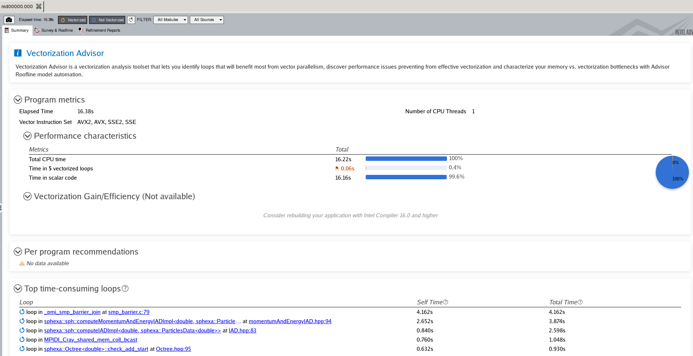
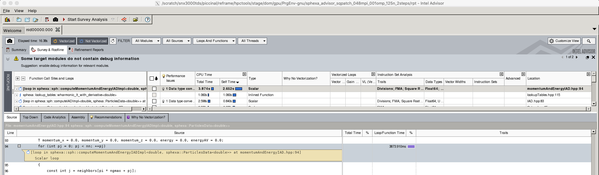

***********************
Intel\ :sup:`®` Advisor
***********************

Intel\ :sup:`®` `Advisor <https://software.intel.com/en-us/advisor>`__ is a
Vectorization Optimization and Thread Prototyping tool:

  - Vectorize & thread code for maximum performance
  - Easy workflow + data + tips = faster code faster
  - Prioritize, Prototype & Predict performance gain.

Running the test
================

The test can be run from the command-line:

.. code-block:: bash

 module load reframe
 cd hpctools.git/reframechecks/intel/

 ~/reframe.git/reframe.py \
 -C ~/reframe.git/config/cscs.py \
 --system daint:gpu \
 --prefix=$SCRATCH -r \
 -p PrgEnv-gnu \
 --performance-report \
 --keep-stage-files \
 -c ./intel_advisor.py

A successful ReFrame output will look like the following:

.. code-block:: bash

 Reframe version: 2.22
 Launched on host: daint101
 
 [----------] started processing sphexa_advisor_sqpatch_024mpi_001omp_100n_0steps (Tool validation)
 [ RUN      ] sphexa_advisor_sqpatch_024mpi_001omp_100n_0steps on dom:gpu using PrgEnv-gnu
 [       OK ] sphexa_advisor_sqpatch_024mpi_001omp_100n_0steps on dom:gpu using PrgEnv-gnu
 [----------] finished processing sphexa_advisor_sqpatch_024mpi_001omp_100n_0steps (Tool validation)
 
 [  PASSED  ] Ran 1 test case(s) from 1 check(s) (0 failure(s))

Several analyses are available:

.. literalinclude:: ../../reframechecks/intel/intel_advisor.py
  :lines: 25-30
  :emphasize-lines: 1

Looking into the :class:`Class <reframechecks.intel.intel_advisor>` shows how
to setup and run the code with the tool. The ``survey`` analysis is
triggered by setting the ``executable_opts``:

.. literalinclude:: ../../reframechecks/intel/intel_advisor.py
  :language: python
  :lines: 133-137

A final step can be added at the end of the job to get the report from the
tool:

.. literalinclude:: ../../reframechecks/intel/intel_advisor.py
  :language: python
  :lines: 147-151
  :emphasize-lines: 3-4

Performance reporting
=====================

A typical output from the ``--performance-report`` flag will look like this:

.. literalinclude:: ../../reframechecks/intel/intel_advisor.py
  :lines: 43-52
  :emphasize-lines: 9-10

This report is generated from the data collected from the tool and processed in
the ``self.perf_patterns`` part of the :class:`check <reframechecks.intel.intel_advisor>`.
This information (elapsed walltime, source filename and line number) is
extracted for mpi rank 0 with the :meth:`advisor_elapsed
<reframechecks.common.sphexa.sanity_intel.advisor_elapsed>`,
:meth:`advisor_loop1_filename
<reframechecks.common.sphexa.sanity_intel.advisor_loop1_filename>`, and
:meth:`advisor_loop1_line
<reframechecks.common.sphexa.sanity_intel.advisor_loop1_line>` methods.
Looking at the report with the tool gives more insight into the performance of
the code:

.. .. literalinclude:: ../../reframechecks/intel/intel_advisor.py
  :lines: 201-204

.. (:ref:`Fig.1 <link_to_myfig1>`) shows that...
.. .. _link_to_myfig1:

   Intel Advisor (launched with: advixe-gui rpt/rpt.advixeproj)

   Intel Advisor (survey analysis)

