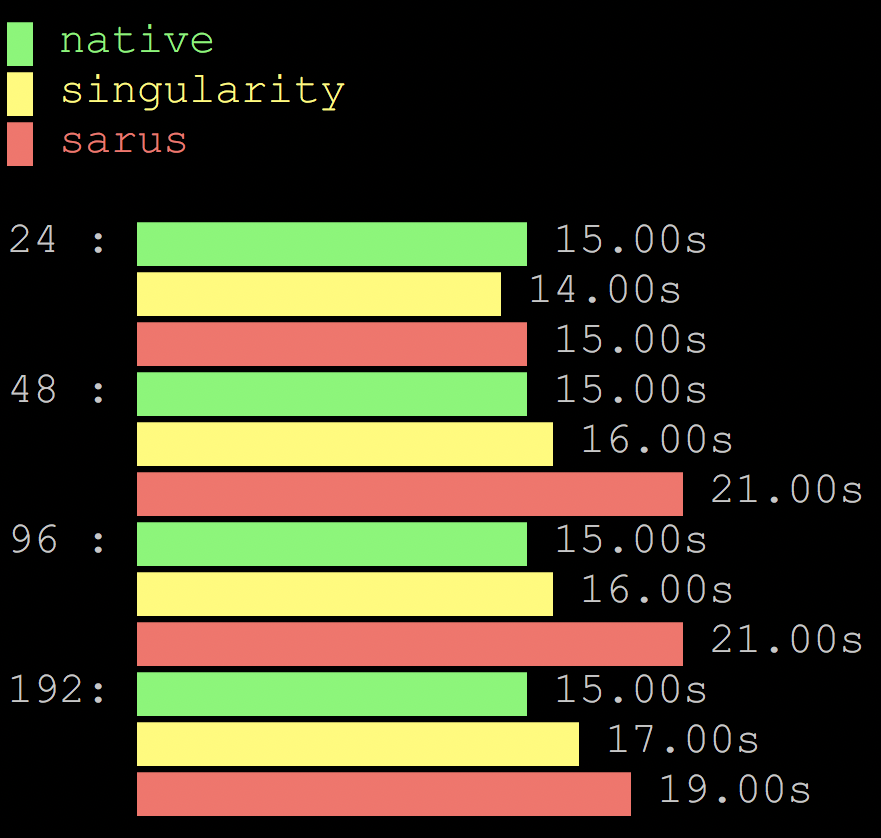

**********
Containers
**********

CSCS currently supports the following container runtimes for running HPC
workloads on Piz Daint:

    * `Sarus <https://user.cscs.ch/tools/containers/sarus/>`__
    * `Singularity <https://user.cscs.ch/tools/containers/singularity/>`__

Getting started
===============

Running the test
----------------

The test can be run from the command-line:

.. code-block:: bash

 module load reframe
 cd hpctools.git/reframechecks/notool/

 ~/reframe.git/bin/reframe \
 -C ~/reframe.git/config/cscs.py \
 --system daint:gpu \
 --prefix=$SCRATCH \
 -p PrgEnv-gnu \
 --performance-report \
 --keep-stage-files \
 -r -c ./internal_timers_mpi_containers.py

A successful ReFrame output will look like the following:

.. code-block:: bash

 [ReFrame Setup]
  version: 3.1-dev0 (rev: 6adcc347)

 [=====] Running 10 check(s)
 
 [-----] started processing compute_singularity_24mpi_2steps (Tool validation)
 [ RUN ] compute_singularity_24mpi_2steps on daint:gpu using PrgEnv-gnu
 [-----] finished processing compute_singularity_24mpi_2steps (Tool validation)
 
 [-----] started processing compute_singularity_48mpi_2steps (Tool validation)
 [ RUN ] compute_singularity_48mpi_2steps on daint:gpu using PrgEnv-gnu
 [-----] finished processing compute_singularity_48mpi_2steps (Tool validation)
 
 [-----] started processing compute_singularity_96mpi_2steps (Tool validation)
 [ RUN ] compute_singularity_96mpi_2steps on daint:gpu using PrgEnv-gnu
 [-----] finished processing compute_singularity_96mpi_2steps (Tool validation)
 
 [-----] started processing compute_singularity_192mpi_2steps (Tool validation)
 [ RUN ] compute_singularity_192mpi_2steps on daint:gpu using PrgEnv-gnu
 [-----] finished processing compute_singularity_192mpi_2steps (Tool validation)
 
 [-----] started processing compute_sarus_24mpi_2steps (Tool validation)
 [ RUN ] compute_sarus_24mpi_2steps on daint:gpu using PrgEnv-gnu
 [-----] finished processing compute_sarus_24mpi_2steps (Tool validation)
 
 [-----] started processing compute_sarus_48mpi_2steps (Tool validation)
 [ RUN ] compute_sarus_48mpi_2steps on daint:gpu using PrgEnv-gnu
 [-----] finished processing compute_sarus_48mpi_2steps (Tool validation)
 
 [-----] started processing compute_sarus_96mpi_2steps (Tool validation)
 [ RUN ] compute_sarus_96mpi_2steps on daint:gpu using PrgEnv-gnu
 [-----] finished processing compute_sarus_96mpi_2steps (Tool validation)
 
 [-----] started processing compute_sarus_192mpi_2steps (Tool validation)
 [ RUN ] compute_sarus_192mpi_2steps on daint:gpu using PrgEnv-gnu
 [-----] finished processing compute_sarus_192mpi_2steps (Tool validation)
 
 [-----] started processing postproc_containers (MPI_Collect_Logs_Test)
 [ RUN ] postproc_containers on daint:gpu using PrgEnv-gnu
 [  DEP ] postproc_containers on daint:gpu using PrgEnv-gnu
 [------] finished processing postproc_containers (MPI_Collect_Logs_Test)
 
 [------] started processing performance_containers (MPI_Plot_Test)
 [ RUN ] performance_containers on daint:gpu using PrgEnv-gnu
 [  DEP ] performance_containers on daint:gpu using PrgEnv-gnu
 [---] finished processing performance_containers (MPI_Plot_Test)
 
 [----] waiting for spawned checks to finish
 [ OK ] ( 1/10) compute_singularity_96mpi_2steps on daint:gpu using PrgEnv-gnu
 [ OK ] ( 2/10) compute_singularity_24mpi_2steps on daint:gpu using PrgEnv-gnu
 [ OK ] ( 3/10) compute_singularity_48mpi_2steps on daint:gpu using PrgEnv-gnu
 [ OK ] ( 4/10) compute_singularity_192mpi_2steps on daint:gpu using PrgEnv-gnu
 [ OK ] ( 5/10) compute_sarus_24mpi_2steps on daint:gpu using PrgEnv-gnu
 [ OK ] ( 6/10) compute_sarus_48mpi_2steps on daint:gpu using PrgEnv-gnu
 [ OK ] ( 7/10) compute_sarus_96mpi_2steps on daint:gpu using PrgEnv-gnu
 [ OK ] ( 8/10) compute_sarus_192mpi_2steps on daint:gpu using PrgEnv-gnu
 [ OK ] ( 9/10) postproc_containers on daint:gpu using PrgEnv-gnu
 [ OK ] (10/10) performance_containers on daint:gpu using PrgEnv-gnu
 [----] all spawned checks have finished
 
 [  PASSED  ] Ran 10 test case(s) from 10 check(s) (0 failure(s))

Performance reporting
---------------------

This test has 3 parts: first, run the code with Singularity, Sarus and Native
(i.e no container), then postprocess the jobs output and plot the timings as a
result. The report is generated automatically after all the compute jobs have
been terminated. The performance data for a couple of steps weak scaling job
from 24 to 192 mpi tasks will typically look like this: 

   Weak scaling (launched with cat performance_containers/termgraph.rpt)

Looking into the :class:`classes
<reframechecks.notool.internal_timers_mpi_containers.SphExa_Container_Base_Check>`
shows how to setup and run the code with the containers. Notice that the
postprocessing and plotting classes depend on the compute classes.
