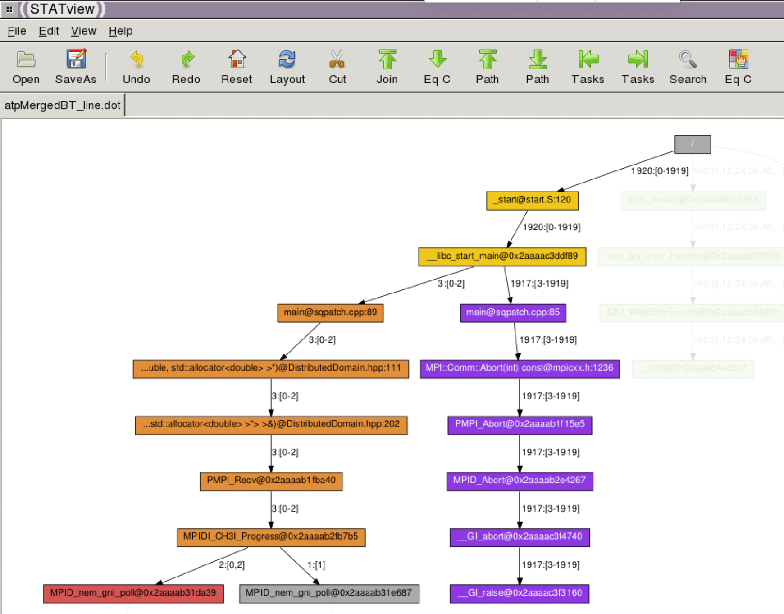

Cray ATP
========

Cray `ATP <https://pubs.cray.com/content/S-2529/17.05/xctm-series-programming-environment-user-guide-1705-s-2529/cray-debugger-support-tools>`__ (Abnormal Termination Processing) is a tool that 
monitors user applications, and should an application take a system trap,
performs analysis on the dying application. All of the stack backtraces of the
application processes are gathered into a merged stack backtrace tree and
written to disk as the file ``atpMergedBT.dot``. 

Running the test
----------------

The test can be run from the command-line:

.. code-block:: bash

 module load reframe
 cd hpctools.git/reframechecks/debug/

 ~/reframe.git/reframe.py \
 -C ~/reframe.git/config/cscs.py \
 --system daint:gpu \
 --prefix=$SCRATCH -r \
 -p PrgEnv-gnu \
 --keep-stage-files \
 -c ./cray_atp.py

A successful ReFrame output will look like the following:

.. code-block:: bash

 Reframe version: 3.0-dev6 (rev: e0f8d969)
 Launched on host: daint101

 [----] waiting for spawned checks to finish
 [ OK ] (1/1) sphexa_atp_sqpatch_024mpi_001omp_50n_1steps on daint:gpu using PrgEnv-gnu
 [----] all spawned checks have finished

 [  PASSED  ] Ran 1 test case(s) from 1 check(s) (0 failure(s))

Looking into the :class:`Class <reframechecks.debug.cray_atp.SphExaATPCheck>`
shows how to setup and run the code with the tool. In this case, the code is
knowingly written in order that the mpi ranks other than 0 and 1 will call
``MPI::COMM_WORLD.Abort`` thus making the execution to crash.

Bug reporting
-------------

An overview of the debugging data will typically look like this:

.. literalinclude:: ../../reframechecks/debug/res/atp/atp.res
  :emphasize-lines: 20, 31

Several files are created:

.. code-block:: none

    atpMergedBT.dot
    atpMergedBT_line.dot
    core.atp.22398835.0.5324
    core.atp.22398835.1743.23855

These files contains useful information about the crash:
    * ``atpMergedBT.dot``: File containing the merged backtrace tree at a simple,
      function-level granularity. This file gives the simplest and
      most-collapsed view of the application state.

    * ``atpMergedBT_line.dot``: File containing the merged backtrace tree at a
      more-complex, source-code line level of granularity. This file shows a
      denser, busier view of the application state and supports modest source
      browsing.

    * ``core.atp.apid.rank``: These are the heuristically chosen core files named
      after the application ID and rank of the process from which they came.

The corefile contains an image of the process's memory at the time of
termination. This image can be opened in a debugger, in this case with gdb:

.. literalinclude:: ../../reframechecks/debug/cray_atp.py
  :lines: 117-121
  :emphasize-lines: 2

A typical report for rank 0 (or 1) will look like this:

.. literalinclude:: ../../reframechecks/debug/res/atp/rpt.rk0
  :lines: 20-27

and for other ranks:

.. literalinclude:: ../../reframechecks/debug/res/atp/rpt.rkn
  :lines: 20-27

The ``atpMergedBT.dot`` files can be viewed with ``stat-view``, a component of the
STAT package (module load stat). The merged stack backtrace tree provides a
concise, yet comprehensive, view of what the application was doing at the time
of the crash.

   ATP/STAT (launched with stat-view atpMergedBT_line.dot, 1920 mpi ranks)

