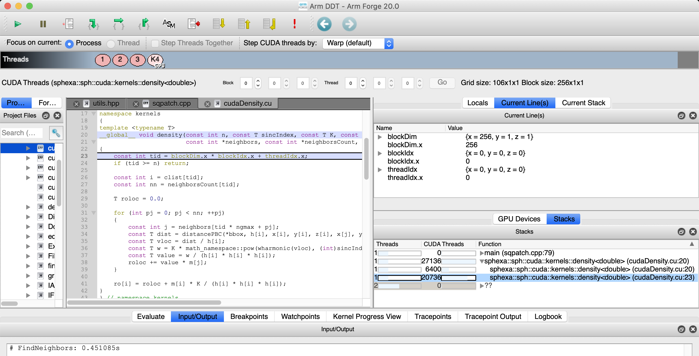
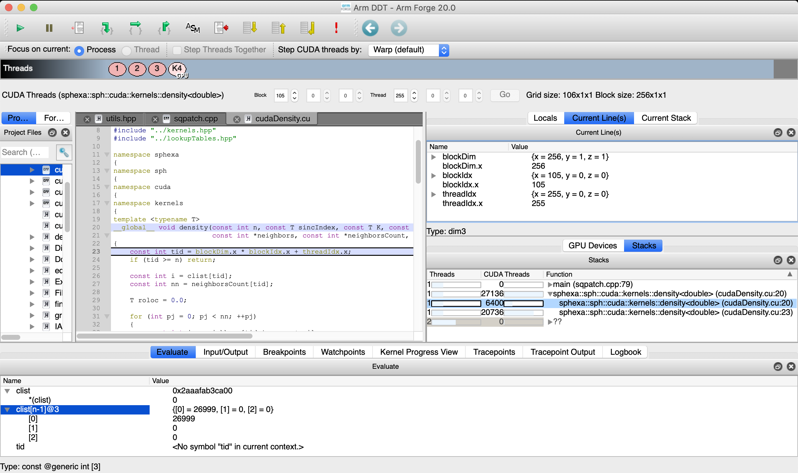
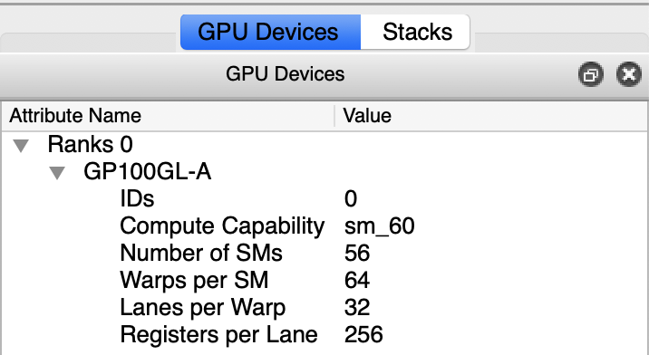
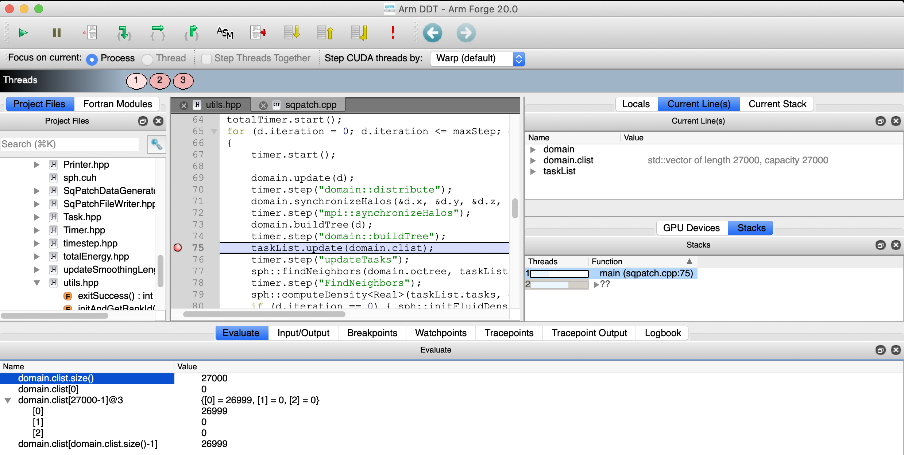
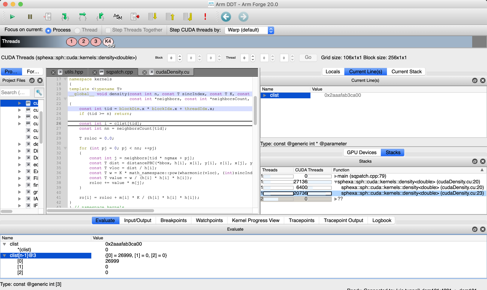
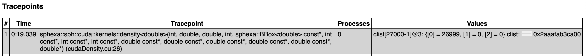

NVIDIA CUDA and ARM Forge DDT
=============================

Arm Forge `DDT <https://user.cscs.ch/computing/analysis/ddt>`__ can be used for
debugging GPU parallel codes.

Running the test
----------------

The test can be run from the command-line:

.. code-block:: bash

 module load reframe
 cd hpctools.git/reframechecks/debug/

 ~/reframe.git/reframe.py \
 -C ~/reframe.git/config/cscs.py \
 --system daint:gpu \
 --prefix=$SCRATCH -r \
 -p PrgEnv-gnu \
 --keep-stage-files \
 -c ./arm_ddt_cuda.py

A successful ReFrame output will look like the following:

.. literalinclude:: ../../reframechecks/debug/res/cuda_ddt/cuda_ddt.res
  :lines: 1-18

Looking into the :class:`Class <reframechecks.debug.arm_ddt_cuda.SphExaCudaDDTCheck>`
shows how to setup and run the code with the tool. 

Bug reporting
-------------

DDT will automatically set a breakpoint at the entrance of cuda kernels.

.. figure:: img/debug/ddt/cuda/break_on_kernel_launch.png
   :align: center
   :scale: 50 %
   :alt: kernel launch

   Arm Forge DDT break on cuda kernel launch

In this example, the first cuda kernel to be launched is the density kernel:

   Arm Forge DDT density kernel (block 0, thread 0)

The Thread Selector allows to select a gpu thread and/or threadblock.

   Arm Forge DDT density kernel (last block, last thread)

Arm DDT also includes a GPU Devices display that gives information about the
gpu device:

   Arm Forge DDT gpu devices info

.. table:: gpu device info
   :align: center

   +---------+--------+------+-------+---------+
   | cuda    | thread | warp | sm    | P100    |
   +=========+========+======+=======+=========+
   | threads | 1      | 32   | 2'048 | 114'688 |
   +---------+--------+------+-------+---------+
   | warps   | x      | 1    | 64    | 3'584   |
   +---------+--------+------+-------+---------+
   | sms     | x      | x    | 1     | 56      |
   +---------+--------+------+-------+---------+
   | P100    | x      | x    | x     | 1       |
   +---------+--------+------+-------+---------+

It can be read as: one NVIDIA Pascal P100 gpu leverages up to 32 threads per warp,
2048 threads per sm, 114'688 threads per device,
64 warps per sm, 3'584 warps per device,
56 sms per device and so on.

As usual, it is possible to inspect variables on the cpu and on the gpu:

   Arm Forge DDT variables (cpu)

   Arm Forge DDT variables (gpu)

.. note:: GPU execution under the control of a debugger is not as fast as
    running without a debugger. 

Running ddt with a tracepoint allows to specify the variables to record at
runtime in batch mode. This is done in the :meth:`set_launcher
<reframechecks.debug.arm_ddt_cuda.SphExaCudaDDTCheck.set_launcher>` method.
An overview of the debugging data will typically look like this in the html
report:

   Arm Forge DDT html report (tracepoints)

and similarly in the txt report:

.. literalinclude:: ../../reframechecks/debug/res/cuda_ddt/rpt_tool.txt
  :lines: 13-24
  :emphasize-lines: 7

