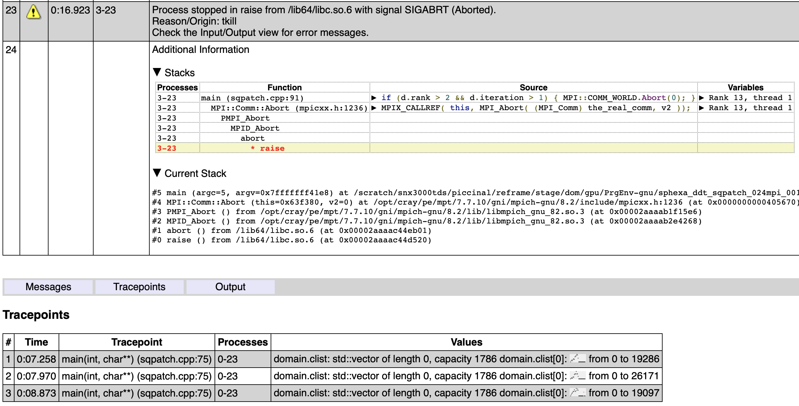
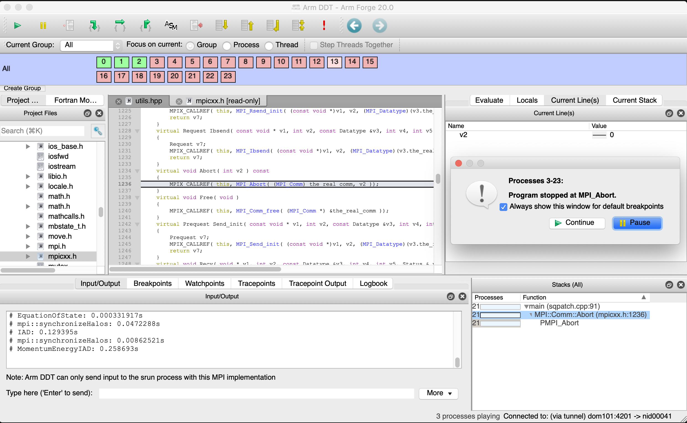
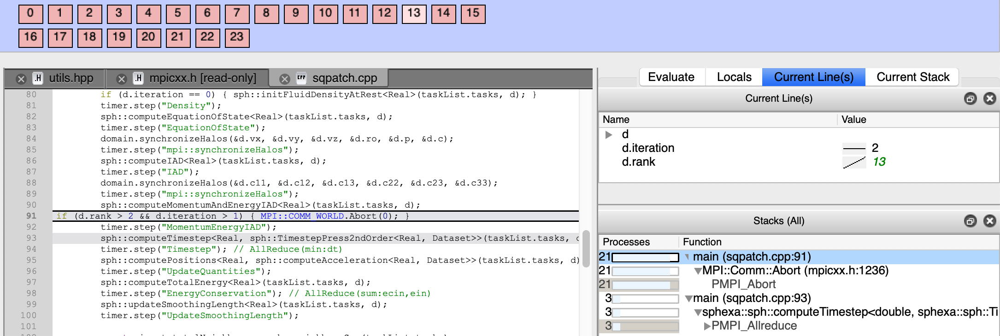

Arm Forge DDT
=============

Arm Forge `DDT <https://user.cscs.ch/computing/analysis/ddt>`__ is a licensed
tool that can be used for debugging serial, multi-threaded (OpenMP),
multi-process (MPI) and accelerator based (Cuda, OpenACC) programs running on
research and production systems, including the CRAY Piz Daint system. It can be
executed either as a graphical user interface (ddt ``--connect`` mode or just ddt)
or from the command-line (ddt ``--offline`` mode).

Running the test
----------------

The test can be run from the command-line:

.. code-block:: bash

 module load reframe
 cd hpctools.git/reframechecks/debug/

 ~/reframe.git/reframe.py \
 -C ~/reframe.git/config/cscs.py \
 --system daint:gpu \
 --prefix=$SCRATCH -r \
 -p PrgEnv-gnu \
 --keep-stage-files \
 -c ./arm_ddt.py

A successful ReFrame output will look like the following:

.. code-block:: bash

 Reframe version: 3.0-dev6 (rev: e0f8d969)
 Launched on host: daint101

 [---] waiting for spawned checks to finish
 [ OK ] (1/1) sphexa_ddt_sqpatch_024mpi_001omp_35n_2steps on daint:gpu using PrgEnv-gnu
 [---] all spawned checks have finished

 [  PASSED  ] Ran 1 test case(s) from 1 check(s) (0 failure(s))

Looking into the :class:`Class <reframechecks.debug.arm_ddt.SphExaDDTCheck>` shows how to setup and run
the code with the tool. In this case, the code is
knowingly written in order that the mpi ranks other than 0, 1 and 2 will call
``MPI::COMM_WORLD.Abort`` thus making the execution to crash.

Bug reporting
-------------

An overview of the debugging data will typically look like this:

.. literalinclude:: ../../reframechecks/debug/res/ddt/rpt_ddt.txt
  :lines: 334-346

The same data can be viewed with a web browser:

   ARM Forge DDT html report (created with ``--offline --output=rpt.html``)

In the same way, using DDT gui will give the same result and more insight about
the crash of the code:

   ARM Forge DDT (All mpi ranks (except 0, 1 and 2) aborted)

   ARM Forge DDT (callstack)

