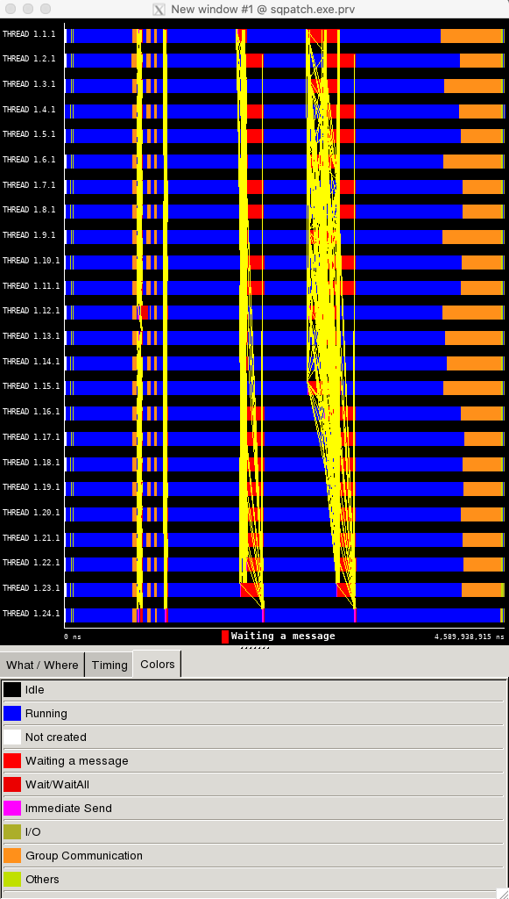

======
Extrae
======

`Extrae <https://tools.bsc.es>`__ is the core instrumentation package developed
by the Performance Tools group at BSC. Extrae is capable of instrumenting
applications based on MPI, OpenMP, pthreads, CUDA1, OpenCL1, and StarSs1 using
different instrumentation approaches. The information gathered by Extrae
typically includes timestamped events of runtime calls, performance counters
and source code references.  Besides, Extrae provides its own API to allow the
user to manually instrument his or her application.

Running the test
================

The test can be run from the command-line:

.. code-block:: bash

 module load reframe
 cd hpctools.git/reframechecks/extrae/

 ~/reframe.git/bin/reframe \
 -C ~/reframe.git/config/cscs.py \
 --system daint:gpu \
 --prefix=$SCRATCH -r \
 -p PrgEnv-gnu \
 --performance-report \
 --report-file $HOME/rpt.json \
 --keep-stage-files \
 -c ./extrae.py

A successful ReFrame output will look like the following:

.. code-block:: bash

 Launched on host: daint101
 
 [----------] started processing sphexa_extrae_sqpatch_024mpi_001omp_100n_1steps (Tool validation)
 [ RUN      ] sphexa_extrae_sqpatch_024mpi_001omp_100n_1steps on daint:gpu using PrgEnv-gnu
 [       OK ] sphexa_extrae_sqpatch_024mpi_001omp_100n_1steps on daint:gpu using PrgEnv-gnu
 [----------] finished processing sphexa_extrae_sqpatch_024mpi_001omp_100n_1steps (Tool validation)
 
 [  PASSED  ] Ran 1 test case(s) from 1 check(s) (0 failure(s))

Looking into the :class:`Class <reframechecks.extrae.extrae>` shows how to
setup and run the code with the tool. 

.. .. literalinclude:: ../../reframechecks/extrae/extrae.py
  :language: python
  :lines: 10-14
  :emphasize-lines: 1

Because the tool relies on ``LD_PRELOAD`` to instrument the executable, it is 
required to set a list of shell commands to execute before launching the job:
``self.pre_run`` will create a wrapper runscript that will launch the code
together with a custom configuration xml file.

Performance reporting
=====================

A typical output from the ``--performance-report`` flag will look like this:

.. literalinclude:: ../../reframechecks/extrae/extrae.res
  :lines: 1-7, 26-41
  :emphasize-lines: 20

This report is generated from the data collected from the tool with
``self.post_run`` and processed in the ``self.perf_patterns`` part of the
:class:`Class <reframechecks.extrae.extrae>`.
For example, the information about the MPI communications for which the size of
the messages is between 10KB and 100KB (``%_of_bytes_sent_10KB-100KB``)
is extracted with the :meth:`rpt_mpistats
<reframechecks.common.sphexa.sanity_extrae.rpt_mpistats>` method (hundKB_b).
Looking at the report with the tool gives more insight into the performance of
the code:

.. (:ref:`Fig.1 <link_to_myfig1>`) shows that...
.. .. _link_to_myfig1:

   Extrae Paraver (launched with: wxparaver sqpatch.exe.prv)
