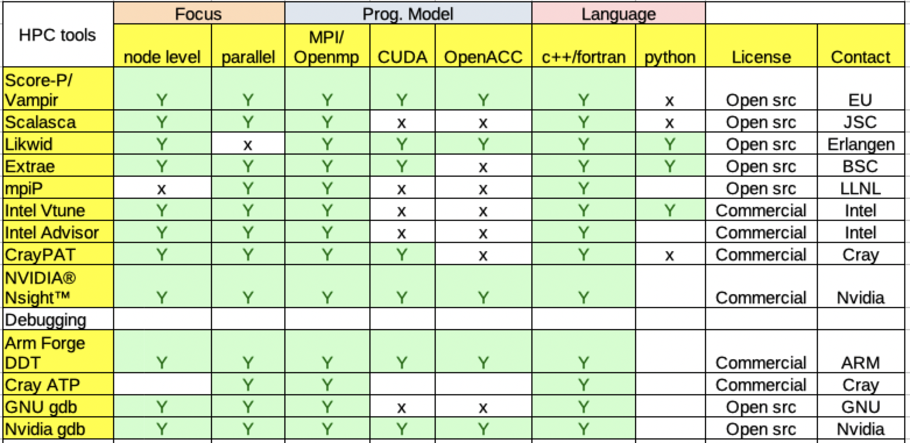

.. this file should at least contain the `toctree` directive.
   
======================================
Welcome to the HPCTools documentation
======================================

`ReFrame <https://github.com/eth-cscs/reframe>`__ is a framework for writing
regression tests for HPC systems. This repository showcases how to use ReFrame
together with HPC tools.

   HPC tools overview

.. toctree::
   :caption: Table of Contents:
   :hidden:

   Getting Started <started>
   Intel tools <intel>
   VI-HPS tools <vi-hps>
   Extrae tools <extrae>
   Statistical tools <mpip>
   Cray tools <perftools>
   Sanity Functions Reference <sanity_functions_reference>
   GPU: NVIDIA <nvidia>
   GPU: Sanity Functions Reference <sanity_functions_reference_gpu>
   Debugging tools <debugging>
   Debugging: Sanity Functions Reference <sanity_functions_reference_debug>

.. this is a comment: `:maxdepth: 2`

Indices and tables
==================

* :ref:`genindex`
* :ref:`modindex`
* :ref:`search`
