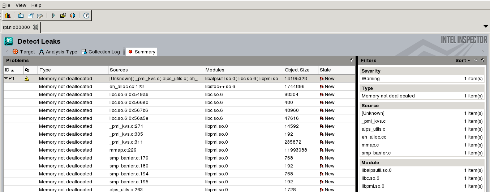

*************************
Intel\ :sup:`®` Inspector
*************************

Intel\ :sup:`®` `Inspector <https://software.intel.com/en-us/inspector>`__ is a
dynamic memory and threading error checking tool. This page will guide you
through writing ReFrame tests to analyze your code with this tool. Using
the same `code <started.html>`_, we set the parameters as follows: 24 mpi
tasks, a cube size of :math:`{100}^3` particles in the 3D square patch test and
only 1 step of simulation:

.. literalinclude:: ../../reframechecks/intel/intel_inspector.py
  :language: python
  :lines: 10-15
  :emphasize-lines: 1

Running the test
================

The test can be run from the command-line:

.. code-block:: bash

 module load reframe
 cd hpctools.git/reframechecks/intel/

 ~/reframe.git/reframe.py \
 -C ~/reframe.git/config/cscs.py \
 --system daint:gpu \
 --prefix=$SCRATCH -r \
 -p PrgEnv-gnu \
 --performance-report \
 -c ./intel_inspector.py

A successful ReFrame output will look like the following:

.. code-block:: bash

 Reframe version: 2.22
 Launched on host: daint101
 
 [----------] started processing sphexa_inspector_sqpatch_024mpi_001omp_100n_0steps (Tool validation)
 [ RUN      ] sphexa_inspector_sqpatch_024mpi_001omp_100n_0steps on dom:gpu using PrgEnv-gnu
 [       OK ] sphexa_inspector_sqpatch_024mpi_001omp_100n_0steps on dom:gpu using PrgEnv-gnu
 [----------] finished processing sphexa_inspector_sqpatch_024mpi_001omp_100n_0steps (Tool validation)
 
 [  PASSED  ] Ran 1 test case(s) from 1 check(s) (0 failure(s))

Looking into the :class:`Class <reframechecks.intel.intel_inspector>` shows how
to setup and run the code with the tool. Several analyses are available:

.. literalinclude:: ../../reframechecks/intel/intel_inspector.py
  :lines: 25-30
  :emphasize-lines: 1

The ``mi1`` (memory leak) analysis is triggered by setting the
``executable_opts``:

.. literalinclude:: ../../reframechecks/intel/intel_inspector.py
  :language: python
  :lines: 135-138

Adding a final step at the end of the job is needed to get the report from the
tool:

.. literalinclude:: ../../reframechecks/intel/intel_inspector.py
  :language: python
  :lines: 149-151
  :emphasize-lines: 2

Performance reporting
=====================

A typical output from the ``--performance-report`` flag will look like this:

.. literalinclude:: ../../reframechecks/intel/intel_inspector.py
  :lines: 43-51
  :emphasize-lines: 9

This report is generated from the data collected from the tool and processed in
the ``self.perf_patterns`` part of the check.  
The number of (``memory not deallocated``) problems detected by the tool
is extracted with the :meth:`inspector_not_deallocated
<reframechecks.common.sphexa.sanity_intel.inspector_not_deallocated>` method.
Looking at the report with the tool shows that the problem comes from a system
library (``libpmi.so``) hence we can assume there is no problem with the code.

.. (:ref:`Fig.1 <link_to_myfig1>`) shows that...
.. .. _link_to_myfig1:

   Intel Inspector (launched with: inspxe-gui rpt.nid00000/)

.. this is a comment: can use `_static/img/s.svg` too
   :scale: 50%

