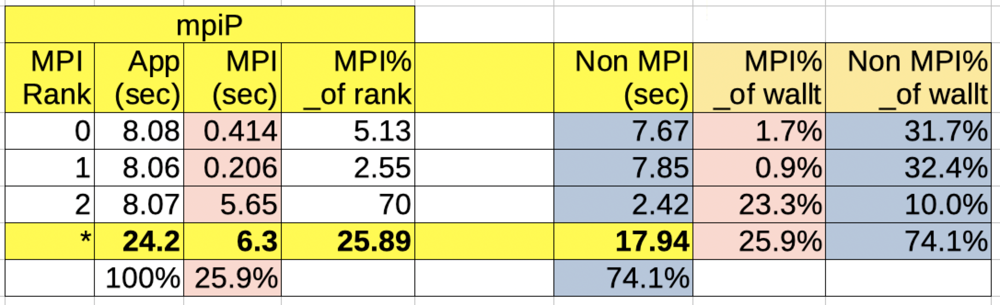

****
mpiP
****

`mpiP <http://llnl.github.io/mpiP>`__ is LLNL's light-weight MPI profiler.

Running the test
================

The test can be run from the command-line:

.. code-block:: bash

 module load reframe
 cd hpctools.git/reframechecks/mpip/

 ~/reframe.git/reframe.py \
 -C ~/reframe.git/config/cscs.py \
 --system daint:gpu \
 --prefix=$SCRATCH -r \
 -p PrgEnv-gnu \
 --performance-report \
 --keep-stage-files \
 -c ./mpip.py

A successful ReFrame output will look like the following:

.. code-block:: bash

 Reframe version: 3.0-dev2 (rev: 6d543136)
 Launched on host: daint101
 
 [----------] waiting for spawned checks to finish
 [       OK ] sphexa_mpiP_sqpatch_024mpi_001omp_100n_3steps on daint:gpu using PrgEnv-gnu
 [       OK ] sphexa_mpiP_sqpatch_048mpi_001omp_125n_3steps on daint:gpu using PrgEnv-gnu
 [       OK ] sphexa_mpiP_sqpatch_096mpi_001omp_157n_3steps on daint:gpu using PrgEnv-gnu
 [----------] all spawned checks have finished
 
 [  PASSED  ] Ran 3 test case(s) from 3 check(s) (0 failure(s))

Looking into the :class:`Class <reframechecks.mpip.mpip>` shows how
to setup and run the code with the tool. Notice that this class is a derived
class hence ``super().__init__()`` is required. 

.. .. literalinclude:: ../../reframechecks/intel/intel_vtune.py
  :language: python
  :lines: 110-114

The performance report is generated automatically at the end of the job.

Performance reporting
=====================

An overview of the performance data for a job with 3 mpi ranks will typically
look like this:

   mpiP (overview)

As a result, a typical output from the ``--performance-report`` flag will look
like this:

.. literalinclude:: ../../reframechecks/mpip/mpip.res
  :lines: 83-110
  :emphasize-lines: 23-28

This report is generated from the data collected from the tool and processed in
the :meth:`set_mpip_perf_patterns <reframechecks.common.sphexa.sanity_mpip.MpipBaseTest.set_mpip_perf_patterns>` method of
the :class:`MpipBaseTest <reframechecks.common.sphexa.sanity_mpip>` class.

This tool outputs text performance report files only.
