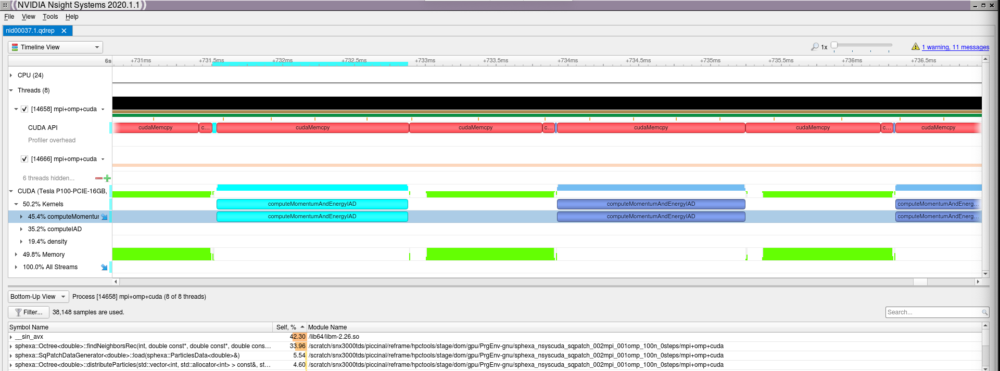

************************
Nsight\ :sup:`™` Systems
************************

NVIDIA\ :sup:`®` Nsight\ :sup:`™` Systems is a system-wide performance analysis
`tool <https://developer.nvidia.com/nsight-systems>`__ designed to visualize an
application’s algorithms, help you identify the largest opportunities to
optimize, and tune to scale efficiently across any quantity or size of CPUs and
GPUs.

CUDA
====

Running the test
----------------

The test can be run from the command-line:

.. code-block:: bash

 module load reframe
 cd hpctools.git/reframechecks/nvidia

 ~/reframe.git/reframe.py \
 -C ~/reframe.git/config/cscs.py \
 --system daint:gpu \
 --prefix=$SCRATCH -r \
 -p PrgEnv-gnu \
 --performance-report \
 --keep-stage-files \
 -c ./nsys_cuda.py

A successful ReFrame output will look like the following:

.. code-block:: bash

 Reframe version: 2.22
 Launched on host: daint101
 
 [----------] started processing sphexa_nsyscuda_sqpatch_002mpi_001omp_100n_0steps (Tool validation)
 [ RUN      ] sphexa_nsyscuda_sqpatch_002mpi_001omp_100n_0steps on daint:gpu using PrgEnv-gnu
 [       OK ] sphexa_nsyscuda_sqpatch_002mpi_001omp_100n_0steps on daint:gpu using PrgEnv-gnu
 [----------] all spawned checks have finished
 
 [  PASSED  ] Ran 1 test case(s) from 1 check(s) (0 failure(s))

Looking into the :class:`Class <reframechecks.nvidia.nsys_cuda>` shows how to
setup and run the code with the tool. 

.. .. literalinclude:: ../../reframechecks/nvidia/nsys_cuda.py
  :language: python
  :lines: 11-15
  :emphasize-lines: 1

``self.executable_opts`` sets a list of arguments to pass to the tool.
The report will be generated automatically at the end of the job.

Performance reporting
---------------------

A typical output from the ``--performance-report`` flag will look like this:

.. literalinclude:: ../../reframechecks/nvidia/nsys_cuda.res
  :emphasize-lines: 26

This report is generated from the data collected from the tool and processed in
the ``self.perf_patterns`` part of the :class:`Class
<reframechecks.nvidia.nsys_cuda>`. For example, the information (%) about the
data transfers from host to device (``[CUDA memcpy HtoD]``) is extracted with
the :meth:`nsys_report_HtoD_pct
<reframechecks.common.sphexa.sanity_nvidia.nsys_report_HtoD_pct>` method.
Looking at the report with the tool gives more insight into the performance of
the code:

.. (:ref:`Fig.1 <link_to_myfig1>`) shows that...
.. .. _link_to_myfig1:

   Nsight Cuda (launched with: nsight-sys nid00036.0.qdrep)
