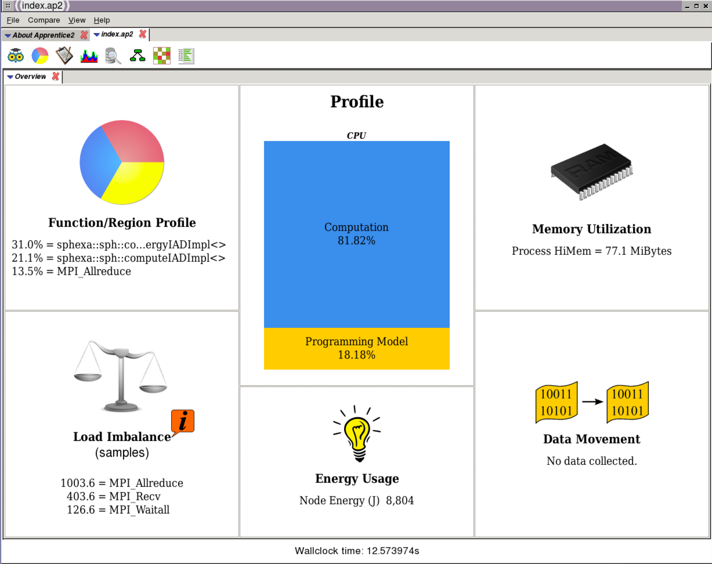
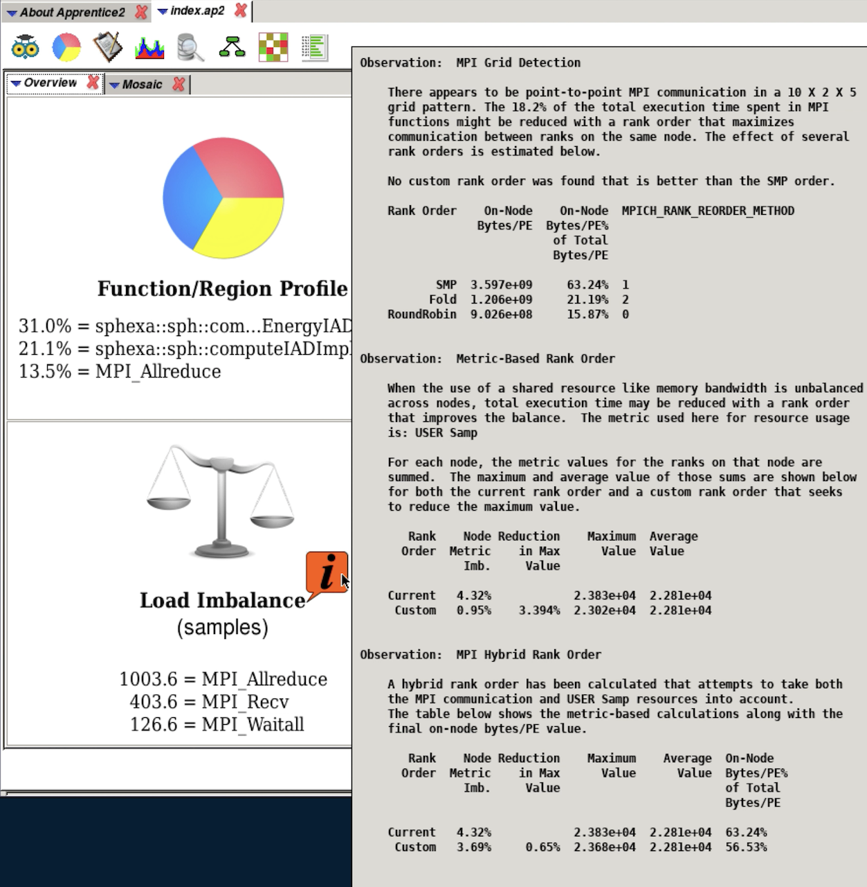
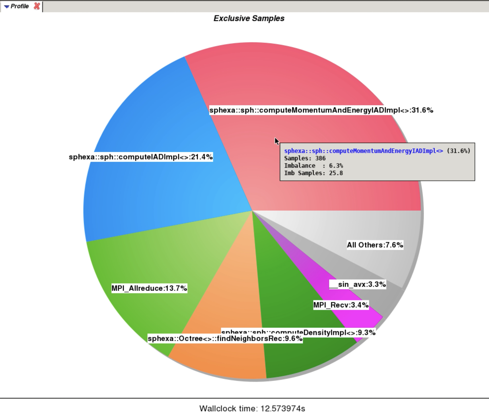
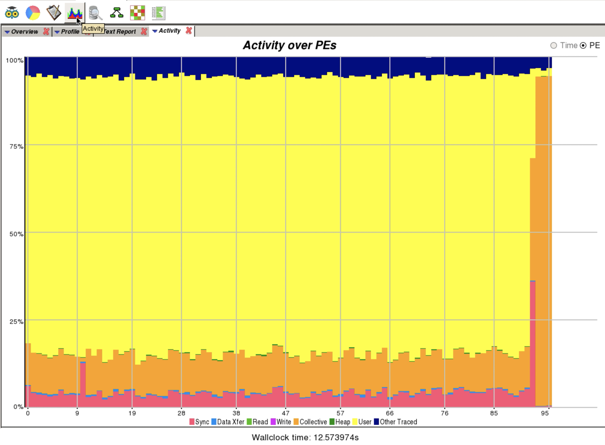
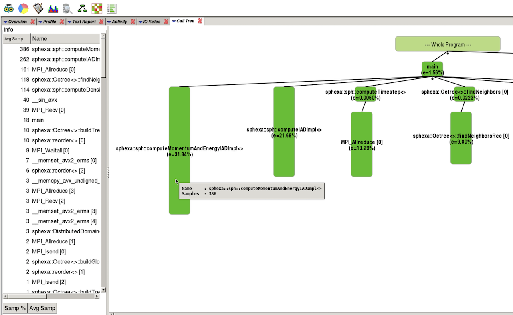
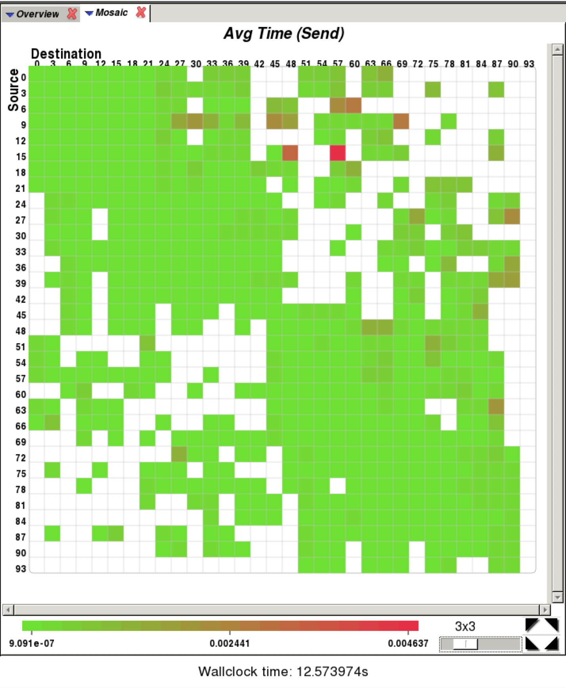

Looking at the report with the tool gives more insight into the performance of the code:

   Apprentice2 (launched with app2 sqpatch.exe+15597-5s/index.ap2)

   Apprentice2 (overview: load imbalance)

   Apprentice2 (overview: exclusive samples)

.. figure:: img/perftools/patrun_app2_03.png
   :align: center
   :alt: Apprentice2 screenshot 03

   Apprentice2 (profile)

   Apprentice2 (timeline)

   Apprentice2 (calltree)

   Apprentice2 (communication matrix)

