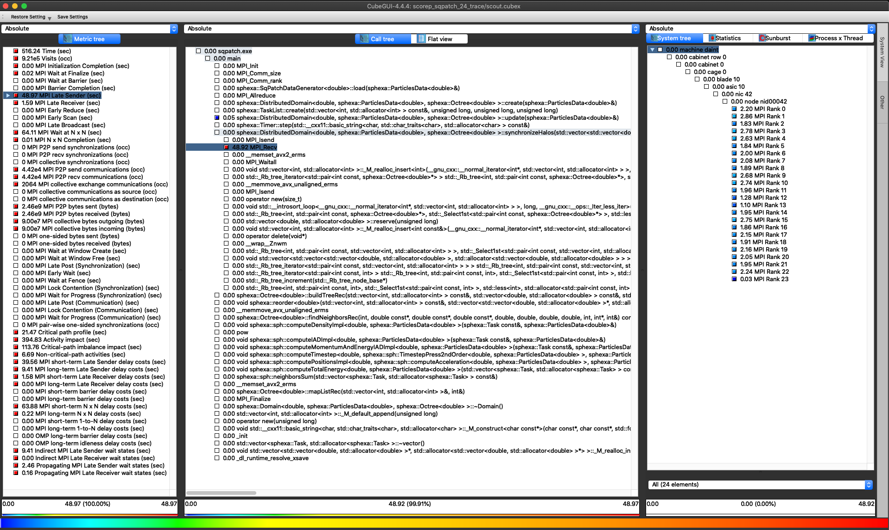
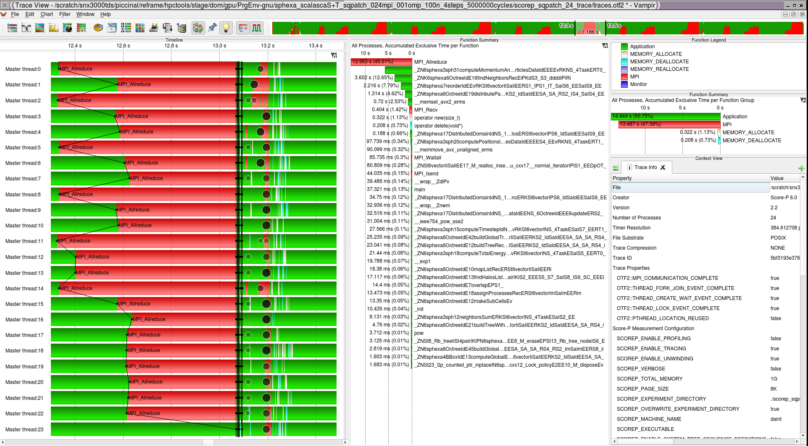

Tracing
=======

Running the test
----------------

The test can be run from the command-line:

.. code-block:: bash

 module load reframe
 cd hpctools.git/reframechecks/scalasca

 ~/reframe.git/reframe.py \
 -C ~/reframe.git/config/cscs.py \
 --system daint:gpu \
 --prefix=$SCRATCH -r \
 -p PrgEnv-gnu \
 --performance-report \
 --keep-stage-files \
 -c ./scalasca_sampling_tracing.py

A successful ReFrame output will look like the following:

.. code-block:: bash

 Reframe version: 2.22
 Launched on host: daint101
 
 [----------] started processing sphexa_scalascaS+T_sqpatch_024mpi_001omp_100n_10steps_1000000cycles (Tool validation)
 [ RUN      ] sphexa_scalascaS+T_sqpatch_024mpi_001omp_100n_10steps_1000000cycles on daint:gpu using PrgEnv-gnu
 [       OK ] sphexa_scalascaS+T_sqpatch_024mpi_001omp_100n_10steps_1000000cycles on daint:gpu using PrgEnv-gnu
 [----------] finished processing sphexa_scalascaS+T_sqpatch_024mpi_001omp_100n_10steps_1000000cycles (Tool validation)
 
 [  PASSED  ] Ran 1 test case(s) from 1 check(s) (0 failure(s))

.. Several analyses are available:  
  .. literalinclude:: ../../reframechecks/intel/intel_advisor.py
  :lines: 25-30
  :emphasize-lines: 1

Looking into the :class:`Class
<reframechecks.scalasca.scalasca_sampling_tracing>` shows how to setup and
run the code with the tool. 

.. .. literalinclude:: ../../reframechecks/scorep/scorep_sampling_profiling.py
  :language: python
  :lines: 10-15
  :emphasize-lines: 1

Set ``self.build_system.cxx`` to instrument the code and set the SCOREP runtime
variables with ``self.variables`` to trigger the (sampling based) `tracing`
analysis. Use ``self.post_run`` to generate the tool's report.

Performance reporting
---------------------

A typical output from the ``--performance-report`` flag will look like this:

.. literalinclude:: ../../reframechecks/scalasca/res/scalasca_sampling_tracing.res
  :lines: 1-31
  :emphasize-lines: 26

This report is generated from the data collected from the tool and processed in
the ``self.perf_patterns`` part of the :class:`Class <reframechecks.scalasca.scalasca_sampling_tracing>`.
For example, the information about the numer of MPI Late Sender is extracted
with the :meth:`rpt_trace_stats_d
<reframechecks.common.sphexa.sanity_scalasca.rpt_trace_stats_d>` method
(latesender).  Cube help describes this metric as the time lost waiting caused
by a blocking receive operation (e.g., MPI_Recv or MPI_Wait) that is posted
earlier than the corresponding send operation. Looking at the report with the
tools (Cube and Vampir) gives more insight into the performance of the code:

.. (:ref:`Fig.1 <link_to_myfig1>`) shows that...
.. .. _link_to_myfig1:

   Scalasca Cube (launched with: cube scorep_sqpatch_24_trace/scout.cubex)

   Scalasca Vampir (launched with: vampir scorep_sqpatch_24_trace/traces.otf2)
