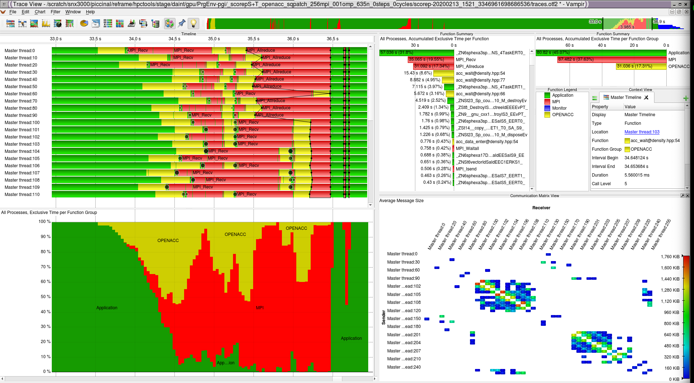

************
VI-HPS tools
************

OPENACC
=======

Running the test
----------------

The test can be run from the command-line:

.. code-block:: bash

 module load reframe
 cd hpctools.git/reframechecks/openacc

 ~/reframe.git/reframe.py \
 -C ~/reframe.git/config/cscs.py \
 --system daint:gpu \
 --prefix=$SCRATCH -r \
 -p PrgEnv-pgi \
 --performance-report \
 --keep-stage-files \
 -c ./scorep_openacc.py

A successful ReFrame output will look like the following:

.. code-block:: bash

 Reframe version: 2.22
 Launched on host: daint101
 
 [----] waiting for spawned checks to finish
 [ OK ] openacc_scorepT_sqpatch_001mpi_001omp_100n_1steps_0cycles_ru_maxrss,ru_utime on daint:gpu using PrgEnv-pgi
 [ OK ] openacc_scorepT_sqpatch_002mpi_001omp_126n_1steps_0cycles_ru_maxrss,ru_utime on daint:gpu using PrgEnv-pgi
 [ OK ] openacc_scorepT_sqpatch_004mpi_001omp_159n_1steps_0cycles_ru_maxrss,ru_utime on daint:gpu using PrgEnv-pgi
 [ OK ] openacc_scorepT_sqpatch_008mpi_001omp_200n_1steps_0cycles_ru_maxrss,ru_utime on daint:gpu using PrgEnv-pgi
 [ OK ] openacc_scorepT_sqpatch_016mpi_001omp_252n_1steps_0cycles_ru_maxrss,ru_utime on daint:gpu using PrgEnv-pgi
 [----] all spawned checks have finished
 
 [  PASSED  ] Ran 5 test case(s) from 1 check(s) (0 failure(s))

Looking into the :class:`Class <reframechecks.openacc.scorep_openacc>` shows
how to setup and run the code with the tool. This check is based on the
``PrgEnv-pgi`` programming environment and the ``Score-P`` and
``otf2_cli_profile`` performance tools. Set ``self.build_system.cxx`` to
instrument the code and set the SCOREP runtime variables with
``self.variables`` to trigger the (OpenACC and rusage) `tracing` analysis.
A text report will be generated using the 
`otf_profiler <./sanity_functions_reference_gpu.html#reframechecks.openacc.scorep_openacc.SphExaNativeCheck.otf_profiler>`__
method at the end of the job.

Performance reporting
---------------------

A typical output from the ``--performance-report`` flag will look like this:

.. literalinclude:: ../../reframechecks/openacc/res/scorep_openacc.res
  :emphasize-lines: 23
  :lines: 148-182

This report is generated from the data collected from the tool and processed in
the ``self.perf_patterns`` part of the :class:`Class
<reframechecks.openacc.scorep_openacc>`. For example, the total size (in Bytes)
of MPI communication the data transfers  (``otf2_messages_mpi_size``) is
extracted with the :meth:`otf2cli_perf_patterns
<reframechecks.common.sphexa.sanity_scorep_openacc.otf2cli_perf_patterns>`
method.

Looking at the report with the tool gives more insight into the performance of
the code:

   Score-P Vampir OpenACC (launched with: vampir scorep-/traces.otf2)
