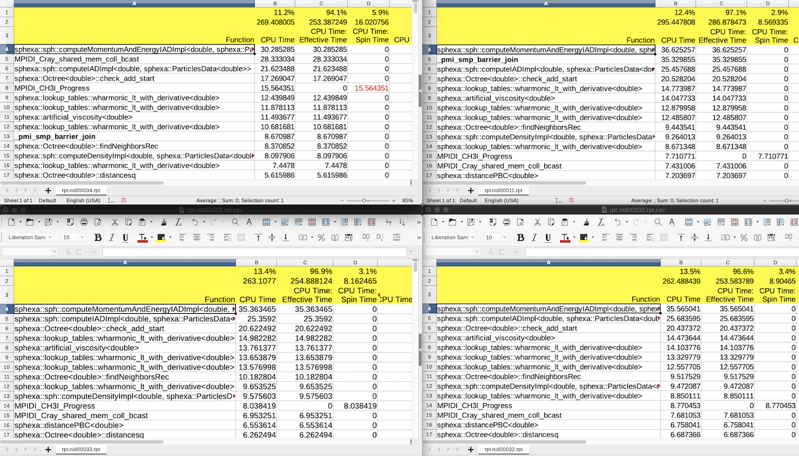
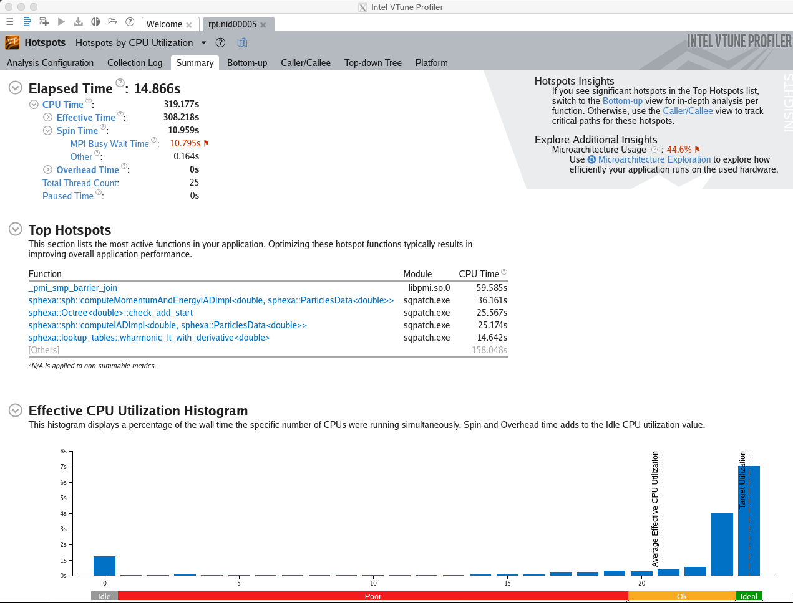
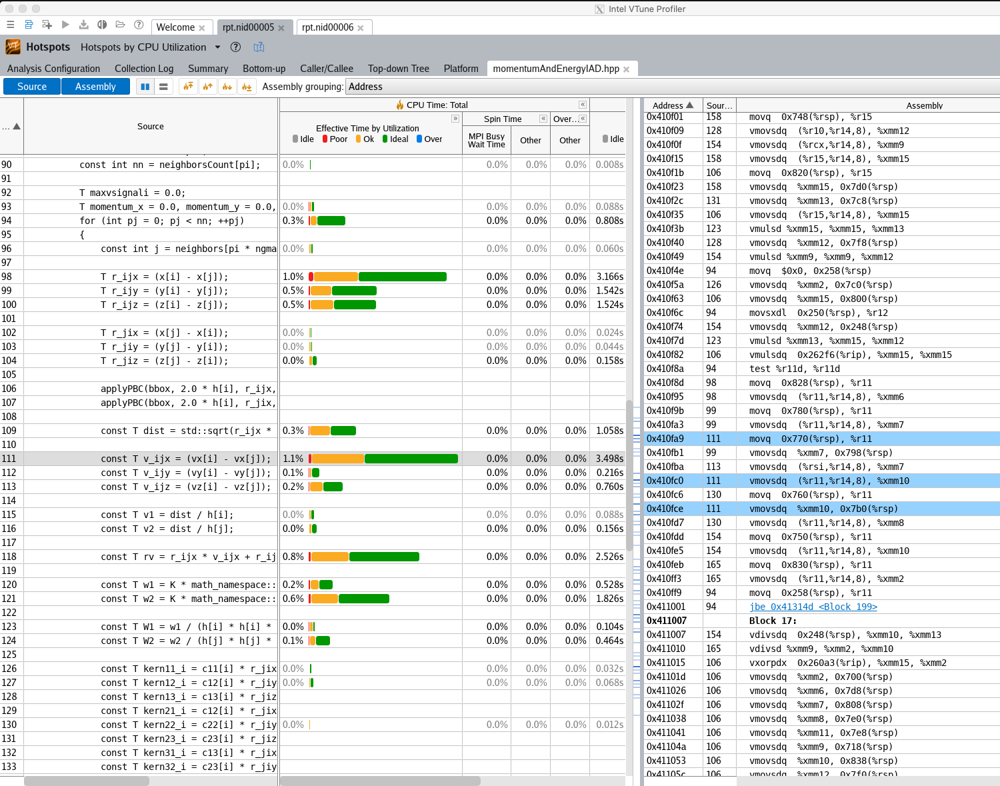

*********************
Intel\ :sup:`®` Vtune
*********************

Intel\ :sup:`®` `Vtune
<https://software.intel.com/en-us/intel-vtune-amplifier-xe>`__ is Intel's
performance profiler for C, C++, Fortran, Assembly and Python.

Running the test
================

The test can be run from the command-line:

.. code-block:: bash

 module load reframe
 cd hpctools.git/reframechecks/intel/

 ~/reframe.git/reframe.py \
 -C ~/reframe.git/config/cscs.py \
 --system daint:gpu \
 --prefix=$SCRATCH -r \
 -p PrgEnv-intel \
 --performance-report \
 --keep-stage-files \
 -c ./intel_vtune.py

A successful ReFrame output will look like the following:

.. code-block:: bash

 Reframe version: 3.0-dev2 (rev: 6d543136)
 Launched on host: daint101
 
 [----------] waiting for spawned checks to finish
 [       OK ] sphexa_vtune_sqpatch_024mpi_001omp_100n_1steps on daint:gpu using PrgEnv-intel
 [       OK ] sphexa_vtune_sqpatch_048mpi_001omp_125n_1steps on daint:gpu using PrgEnv-intel
 [       OK ] sphexa_vtune_sqpatch_096mpi_001omp_157n_1steps on daint:gpu using PrgEnv-intel
 [----------] all spawned checks have finished
 
 [  PASSED  ] Ran 3 test case(s) from 3 check(s) (0 failure(s))

Several analyses are available:

.. literalinclude:: ../../reframechecks/intel/intel_vtune.res
  :lines: 1-18
  :emphasize-lines: 1

Looking into the :class:`Class <reframechecks.intel.intel_vtune>` shows how
to setup and run the code with the tool. Notice that this class is a derived
class hence ``super().__init__()`` is required. The ``hotspots`` analysis is
triggered by setting the ``executable_opts``.

.. .. literalinclude:: ../../reframechecks/intel/intel_vtune.py
  :language: python
  :lines: 110-114

Use ``self.post_run`` to generate the report with the tool. Notice that the
tool collects performance data per compute node.

Performance reporting
=====================

An overview of the performance data for a 4 compute nodes job will typically
look like this:

   Intel Vtune (overview)

As a result, a typical output from the ``--performance-report`` flag will look
like this:

.. literalinclude:: ../../reframechecks/intel/intel_vtune.res
  :lines: 166-207
  :emphasize-lines: 23-42

This report is generated from the data collected from the tool and processed in
the ``set_vtune_perf_patterns_rpt`` method of the :class:`check
<reframechecks.common.sphexa.sanity_vtune>`.

Looking at the report with the tool gives more insight into the performance of
the code:

   Intel Vtune Summary view (launched with: vtune-gui rpt.nid00034/rpt.nid00034.vtune)

   Intel Vtune Hotspots (Src/Assembly view)

